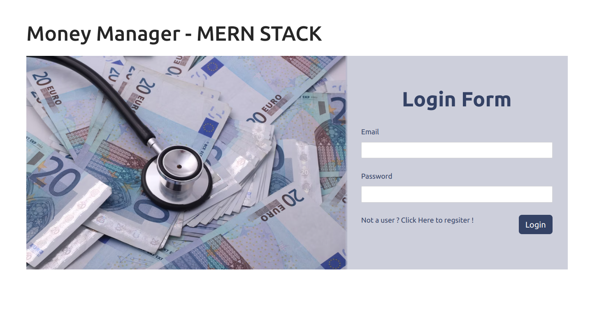
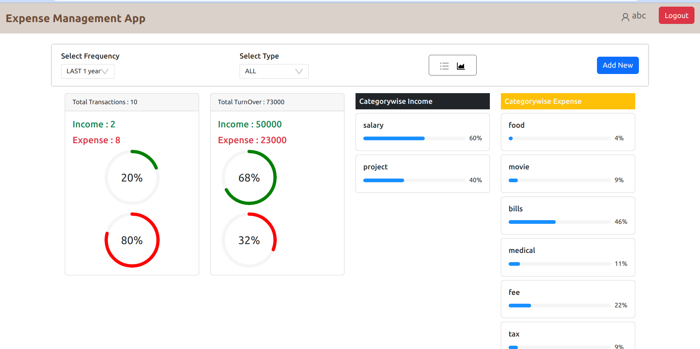

# Money Manager MERN Web App

## Description

Money Manager is a full-stack web application built using the MERN (MongoDB, Express.js, React.js, Node.js) stack. It provides a convenient way to track your income and expenses, allowing you to effectively manage your budget.

Watch the demo video:<a href="https://youtu.be/MG2KQYKtrfs" target="_blank">Demo Video</a>

## Technology Used

- MongoDB: A NoSQL database used to store user information and transaction data.
- React.js: A JavaScript library used for building the user interface and managing the frontend components.
- Express.js: A web application framework used to build the backend server and handle API requests.
- Node.js: A JavaScript runtime environment used to execute JavaScript code on the server side.

## Features

### Register and Login Page

The application provides a user registration and login functionality. Users can create an account by providing their email address and password. They can then use their credentials to log in to the application.

### Home Page

Once logged in, users are directed to the home page where they can add their income and expenses. They can specify the type of transaction, amount, and category. The application stores the transactions in the database, allowing users to keep track of their financial activities.

### Chart Page

The chart page displays a visual representation of the user's budget. It presents the income and expense data in a graphical format, making it easier for users to analyze and understand their financial situation.

## Conclusion

The Money Manager MERN web app provides a user-friendly way to track income and expenses, helping users effectively manage their budget. With its intuitive interface and visual representation of financial data, it simplifies the process of staying on top of personal finances.
